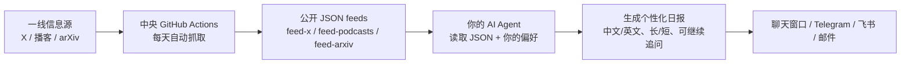

# AI Signal

追踪 AI 一线的声音——做事的人、写代码的人、下注的人，不是二手转述。

这是一份给 AI Agent 用户的精心筛选信息源。中央每天自动抓取播客、推文和论文；你的 Agent 读取 JSON，按你的口味生成日报。

**这份清单本身就是产品。**

如果这个项目对你有帮助，欢迎在 GitHub 点一下 Star，让更多需要 AI 一线信号的人看到它。

## 最近更新

- `2026-07-08`：新增 Naval Ravikant——加入 X 人物追踪、YouTube 人物访谈搜索和 Naval RSS 播客频道；Naval 频道单独使用 14 天窗口，避免错过低频长节目
- `2026-07-08`：人物追踪剔除"被谈论但本人没出场"的视频——标题语法守卫识别 "记者 on 某人"/"the truth about 某人" 这类评论内容，只收本人真实出场的访谈
- `2026-07-08`：定时任务默认限时拉到 15 分钟，避免网络或模型较慢时任务被中途杀掉后反复重启；OpenClaw cron 模板加 `--timeout-seconds 900`，其他平台要求任务限时 ≥10 分钟，另加故障排查一节
- `2026-07-07`：修复论文抓不到最新——arXiv 的 `submittedDate` 排序索引滞后（已知问题）导致"最新论文"卡在 3-4 天前，叠加时间窗把结果筛空、静默喂旧数据。改用 `lastUpdatedDate` 实时排序 + 72h 窗口，恢复抓当天最新论文
- `2026-07-06`：新增官方博客追踪——Anthropic / OpenAI / Google DeepMind 的模型发布、产品上线、研究成果直接进日报（编号 B1/B2，可展开）
- `2026-07-06`：大陆直连加固——feed 镜像从 2 个扩到 5 个 CDN 入口，被阻断的源 5 秒快速跳过（回应用户反馈"没 VPN 拉不到数据"）
- `2026-07-05`：新增人物追踪——28 位 AI 高管/分析师/创始人上任何播客都会被抓到（不再限于订阅频道），只收本周上传的最新访谈
- `2026-07-05`：修正 3 个 X 账号 handle（Dylan Patel / Leopold Aschenbrenner / Jim Keller 此前配错，一直抓不到推文）
- `2026-07-05`：feed 拉取加多源镜像——GitHub 不可达时自动切 jsDelivr CDN
- `2026-07-05`：推文加主题过滤，节日祝福 / 生活动态等噪音不再进 feed
- `2026-07-04`：安装瘦身——用户侧只需 `httpx[socks]`；修复 SOCKS 代理下拉取失败与 Python 3.9 装不上

完整历史见 [CHANGELOG](CHANGELOG.md)。

---

## 你会得到什么

由你的 AI Agent 读取中央 JSON 后生成一份日报（可直接在聊天里看；如果你的 Agent 支持定时任务，也可以每天自动推送），包含：

- 一线播客的最新内容（日报先给简介；你说“展开 P2”后再按需读取该期全文字幕）
- 精选推特账号的当日观点
- Anthropic / OpenAI / Google DeepMind 官方博客的最新发布（新模型、产品、研究、安全框架）
- arXiv 最新 AI/ML/NLP 论文标题、链接和摘要原文
- 每条播客、推文和论文都显示来源发布时间，并按你的时区转换；无法验证的时间会明确标记
- 按你的偏好定制：中文 / 英文 / 双语，精华 / 标准 / 完整
- 不需要内容 API key——所有内容由中央服务统一抓取

> AI Signal 是 **Agent-first** 架构：中央只供料，不替每个用户生成最终日报。真正的总结、翻译、格式定制，都由用户自己的 Agent 完成。

## 日报不是终点

日报只是第一层筛选。看完以后你可以继续让 Agent 展开任意一条内容，尤其是长播客：

- “展开第 2 个播客”
- “把 Vercel agents 这期做一个 breakdown”
- “这期播客按核心观点、论证链、关键引用、投资含义展开”

如果该播客有全文字幕，日报会标记为可展开；只有你明确要求“展开 P2”后，Agent 才会按 `guid` 拉取这一期全文，而不是每天预先下载所有字幕。

字幕从最后一次出现在最近更新 feed 起保留 14 天。播客退出主 feed 后，仍可通过字幕索引展开；超过 14 天后全文缓存自动过期，只保留日报中的标题、链接和已有摘要。

## 信息源

### 播客（14 个频道）

| 频道 | 为什么选 |
|------|----------|
| [Dwarkesh Patel](https://www.dwarkesh.com) | 最深度的 AI 一对一访谈，嘉宾全是一线研究者 |
| [Lex Fridman](https://lexfridman.com/podcast/) | 覆盖面最广的 AI 长对话 |
| [Latent Space](https://www.latent.space) | AI 工程师生态的脉搏，Swyx 主理 |
| [All-In Podcast](https://www.allinpodcast.co) | 四个顶级 VC 的周度辩论，AI + 宏观 |
| [a16z](https://a16z.com/podcasts/) | 硅谷最大 VC 的一手投资视角 |
| [Naval](https://nav.al/) | Naval Ravikant 对 AI、技术、创业和资本形成的长线判断 |
| [No Priors](https://www.youtube.com/@NoPriorsPodcast) | Sarah Guo + Elad Gil，AI infra 创始人密度最高 |
| [SemiAnalysis](https://www.youtube.com/@SemiAnalysis) | Dylan Patel，半导体与 AI 基础设施最深度的独立分析 |
| [Google DeepMind](https://deepmind.com/podcast) | DeepMind 官方，前沿研究视角 |
| [Lightcone (YC)](https://www.youtube.com/@ycombinator) | YC 合伙人看 AI 创业生态 |
| [Lenny's Podcast](https://www.lennysnewsletter.com/) | AI 产品落地的一线反馈 |
| [Invest Like the Best](https://www.joincolossus.com/episodes) | 顶级投资人的思维框架 |
| [Capital Allocators](https://capitalallocators.com/podcast/) | 机构投资者视角 |
| [The Acquirers Podcast](https://acquirersmultiple.com/podcast/) | 价值投资方法论 |

### 人物追踪（28 人，全网搜索）

频道订阅之外，每天在 YouTube 全网搜索这些人作为**嘉宾**出现的访谈（RSS 只覆盖主持人自己的节目，这里补他们上别人节目的场合），搜索用 YouTube 服务端"本周上传"过滤器限定，只收最新的：

**海外**：Sundar Pichai、Greg Brockman、Sam Altman、Demis Hassabis、Jensen Huang、Satya Nadella、Mark Zuckerberg；Anthropic 全线（Dario / Daniela Amodei、Krishna Rao、Mike Krieger、Sholto Douglas、Amanda Askell、Boris Cherny、Cat Wu、Alex Albert）；Kevin Weil（OpenAI CPO）、Ivan Zhao（Notion）、Dylan Patel（SemiAnalysis）、Gavin Baker（Atreides）、Naval Ravikant

**中国 AI**：闫俊杰（MiniMax）、杨植麟（月之暗面）、梁文锋（DeepSeek）、唐杰（智谱）、罗福莉、李广密（拾象）、肖弘（Manus）

> 过滤规则：只收本周上传（YouTube 服务端过滤）、标题必须含人名（去同名假阳性）、时长 ≥ 15 分钟（去切片/shorts）、频道订阅数 ≥ 5 万（去小搬运号）、海外人物剔除非拉丁文字频道名/标题（去大号外语搬运/二创，如中文配音、印地语二创、韩语搬运）、海外人物要求视频有英文字幕轨（挡住英文标题的外语综艺，如韩综 You Quiz 上的 Jensen Huang 只有韩语字幕；只要英文原版）、剔除例行盘面播报和影视剧合集噪音；与频道订阅命中的同一期节目自动去重；每天最多新收 5 条，日报不会被人物命中刷屏。名单在 `config/sources.json` 的 `podcasts.people`。

### Twitter/X（19 个账号）

**分析师/研究者**：[@karpathy](https://x.com/karpathy)、[@swyx](https://x.com/swyx)、[@dylan522p](https://x.com/dylan522p)（SemiAnalysis）、[@insane_analyst](https://x.com/insane_analyst)（Irrational Analysis，半导体投资）、[@naval](https://x.com/naval)（Naval Ravikant）、[@leopoldasch](https://x.com/leopoldasch)、[@jimkxa](https://x.com/jimkxa)（Jim Keller）

**决策者**：[@sama](https://x.com/sama)、[@DarioAmodei](https://x.com/DarioAmodei)、[@demishassabis](https://x.com/demishassabis)（Google DeepMind）、[@jietang](https://x.com/jietang)（Z.ai / Tsinghua）

**基础设施**：[@nvidia](https://x.com/nvidia)（Jensen Huang / NVIDIA AI 基础设施信号）

**建造者**：[@AmandaAskell](https://x.com/AmandaAskell)、[@bcherny](https://x.com/bcherny)（Claude Code）、[@_catwu](https://x.com/_catwu)、[@alexalbert__](https://x.com/alexalbert__)、[@rauchg](https://x.com/rauchg)（Vercel）、[@amasad](https://x.com/amasad)（Replit）、[@joshwoodward](https://x.com/joshwoodward)（Google Labs）

> 选人标准：在一线做事 / 有独立判断 / 用真金白银下注。不选搬运号、评论员、流量账号。

> 内容门槛：默认剔除回复，并要求互动分数达到 10（点赞 + 2×转发 + 回复）；小众账号可在 `config/sources.json` 单独降低门槛或允许回复。刚发布但互动不足的内容可能延后到下一次抓取。

### 官方博客（3 家）

| 来源 | 抓取方式 |
|------|----------|
| [Anthropic](https://www.anthropic.com/news) | 官方 sitemap（Anthropic 无 RSS）+ 文章页真实发布日期过滤 |
| [OpenAI](https://openai.com/news/) | 官方 RSS |
| [Google DeepMind](https://deepmind.google/blog/) | 官方 RSS |

> 模型发布、产品上线、研究成果、安全框架，第一时间从官方渠道进日报，不等二手转述。每家每天最多 5 条，48 小时窗口。

### arXiv 论文（每日最多 30 篇）

| 分类 | 覆盖范围 |
|------|----------|
| cs.AI | 人工智能 |
| cs.CL | 计算语言学（LLM / NLP 论文主阵地） |
| cs.LG | 机器学习 |

> 使用 5 天滚动窗口跨过周末和休刊时段，客户端按论文 ID 去重，不会重复推送。中央每天北京时间 06:00 做全量抓取，工作日约 09:30 再做一次 arXiv 专用刷新，以避开新论文批次尚未发布的空窗；09:30 前的早报可能仍使用上一批论文。

## 快速开始

打开你的 AI Agent（OpenClaw / Claude Code / Cursor / WorkBuddy / Codex 等），说一句话：

> **帮我安装 https://github.com/Benboerba620/ai-signal**

AI 会自动完成安装，然后引导你设置推送频率和时间、语言、详细程度和输出方式。设置完**立刻生成第一份日报**。

不需要敲命令、不需要内容 API key。你需要一个能运行这个 skill 的 AI Agent。

<details>
<summary>手动安装（如果你的 Agent 不支持自动安装）</summary>

```bash
# OpenClaw
git clone https://github.com/Benboerba620/ai-signal.git ~/skills/ai-signal
cd ~/skills/ai-signal/scripts && pip install -r ../requirements.txt

# Claude Code
git clone https://github.com/Benboerba620/ai-signal.git ~/.claude/skills/ai-signal
cd ~/.claude/skills/ai-signal/scripts && pip install -r ../requirements.txt

# 其他
git clone https://github.com/Benboerba620/ai-signal.git
cd ai-signal/scripts && pip install -r ../requirements.txt
```

**国内网络 clone 失败？** 用镜像加速前缀（示例，失效就换一个同类服务）：

```bash
git clone https://gh-proxy.com/https://github.com/Benboerba620/ai-signal.git
# 或
git clone https://ghfast.top/https://github.com/Benboerba620/ai-signal.git
```

安装后的每日 feed 更新不依赖代理：GitHub 直连失败时自动切换 jsDelivr CDN 镜像。

安装完成后告诉你的 Agent：**"set up ai signal"**

</details>

## 定制

所有偏好都可以用对话修改：

| 设置 | 选项 | 对话示例 |
|------|------|----------|
| 语言 | 中文 / 英文 / 双语 | "切换成中文" |
| 详细程度 | 精华 / 标准 / 完整 | "我要更详细的" |
| 领域 | AI / 投资 | "只看 AI 的" |
| 推送 | Telegram / 飞书 / 邮件 / 聊天 | "推到 Telegram" |

### 本地反馈

看完日报后可以直接说“P2 有用”“X1 是噪音”“多看芯片”或“少看融资新闻”。Agent 会把反馈保存在本机 `~/.ai-signal/feedback.jsonl`，最近 90 天的反馈会作为下一份日报的软排序偏好，不上传到中央服务，也不会因为一次负面反馈永久屏蔽重大消息。

用户要求展开某期播客时，会自动记录一次 `expanded`，用来观察哪些内容真正引发深读；展开只代表兴趣，不自动等同于“有用”。

### 自定义摘要风格

编辑 `~/.ai-signal/prompts/` 下的文件：

- `summarize-podcast.md` — 播客怎么总结
- `summarize-tweets.md` — 推文怎么提炼
- `summarize-papers.md` — 论文怎么摘要
- `digest-intro.md` — 整体语气和格式

纯文本指令，不是代码。改完下次推送生效。

## 工作原理



简单说：中央只负责每天把 AI 一线原料抓好，用户自己的 Agent 负责筛选、翻译、总结和推送。这样不需要每个用户准备内容 API key，也不会把你的阅读偏好上传到中央服务。

**你不需要任何内容 API key。** 内容抓取在中央完成，摘要由你自己的 AI Agent 读取 JSON 后生成。

默认是 **JSON-first**：中央只提供原始 feed，不生成中文版日报。这能减少中文、emoji、长播客字幕在命令行、定时任务和推送链路里的编码问题。中央 LLM 摘要能力仍保留为手动调试选项，但不是默认用户路径。

## 要求

- 一个 AI Agent（OpenClaw、Claude Code、Cursor、WorkBuddy、Codex 等均可）
- 网络连接（拉取中央 feed；不需要 VPN——GitHub 不可达时自动走 jsDelivr CDN 镜像）

就这些。不需要内容 API key。所有内容由中央统一抓取，每天自动更新。若要无人值守地每天自动收到，需要使用支持定时任务的 Agent；普通非持久 Agent 更适合手动输入 `/ai-signal` 查看。

## 隐私

- 不采集任何用户数据
- 你的配置和偏好只存在你自己的机器上（`~/.ai-signal/`）
- 只聚合公开内容（公开推文、公开播客、公开论文）

## 关于

这份清单来自一个二级市场研究员的日常信息源。筛选标准只有一个：**这个人说的话，值不值得我每天花时间看。**

公众号「奔波儿r」· [GitHub](https://github.com/Benboerba620)

## License

MIT
